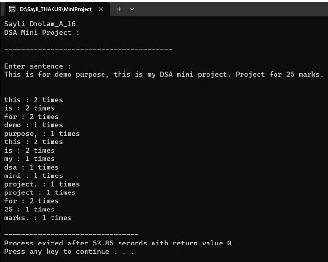

# Word_Frequency_Count
Developed in C++ using DSA concept : Hashing 

 

## Problem Statement
With this project, we can count the frequency of each word in a statement. 
 

## Data Structure Concept Used: HASH TABLE

The hashing concept is involved implicitly when using unordered_map. The 
unordered_map is a hash table implementation, and it uses a hash function to 
map keys to indices in its underlying array.  

This allows for efficient insertion, deletion, and retrieval of elements based on 
their keys. In this code, the words in the input text serve as keys, and their 
frequencies are stored in the hash table. The unordered_map handles the 
hashing details internally. 
 
A hash table is a data structure that uses a hash function to map keys to indices 
in an array. This allows for efficient storage and retrieval of key-value pairs. In 
the case of std::unordered_map, the keys are hashed, and the resulting hash.

 

 *Output Screen*
